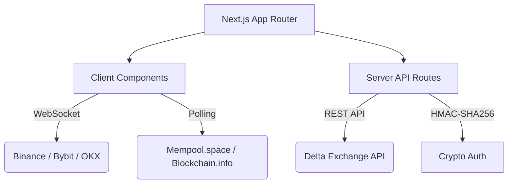

<div align="center">

# 🚀 BTC Market & Liquidation Dashboard
**Real-Time Analytics • On-Chain Data • Autonomous Algorithmic Trading**

[](https://nextjs.org/)
[](https://www.typescriptlang.org/)
[](https://reactjs.org/)
[](https://www.delta.exchange/)

*A state-of-the-art, high-frequency dashboard engineered to monitor massive crypto liquidations and automatically execute algorithmic trades using a premium glassmorphism UI.*

<br/>

</div>

---

## ✨ Features at a Glance

<div align="center">

| ⚡ Live Liquidations | 📊 Market Data | 🤖 Trading Engine |
| :---: | :---: | :---: |
| **Multi-Exchange**<br/>Binance, Bybit, OKX WebSockets | **On-Chain Tracking**<br/>Mempool & Blockchain.info | **Algorithmic Signal**<br/>Multi-factor logic (Buy/Sell) |
| **Whale Tracker**<br/>Visual alerts for >$100k liquidations | **Global Ratios**<br/>Live Long/Short & Open Interest | **Auto-Trader Integration**<br/>Direct Delta Exchange execution |
| **Aggregated Charts**<br/>Running USD totals by side | **Whale Movements**<br/>Live unconfirmed large TXs | **Safety Limits**<br/>Paper trading & cooldowns |

</div>

---

## 💎 Premium Aesthetics

This dashboard doesn't just display data—it provides an **experience**.
- **True Glassmorphism:** Cards feature deep blur overlays (`backdrop-filter`) simulating physical translucent glass.
- **Ambient Mesh Background:** A slow-moving particle/mesh gradient floating in the background makes the UI feel alive.
- **Dynamic Glows:** Highly saturated neon palettes with drop-shadow glows emulate a physical LED trading terminal.
- **Micro-Animations:** Fluid hover states, smooth row sliding, and organic pulsing indicators for live data streams.

---

## 🏗️ Architecture & Tech Stack



### Powered By:
* **Framework**: React / Next.js (App Router)
* **Styling**: Pure CSS (`globals.css`) with advanced CSS Variables & Transitions
* **Data Sources**: Native WebSockets + Native `fetch` with caching
* **Security**: Native Node.js `crypto` for securely signing API requests

---

## 🚀 Getting Started

Follow these steps to run the dashboard locally.

### 1. Prerequisites
Ensure you have **Node.js 18.17+** installed.

### 2. Environment Variables (For Live Trading)
If you intend to use the Live Auto-Trader, securely provide your Delta Exchange API credentials. Create a `.env.local` file in the root directory:

```env
DELTA_API_KEY=your_api_key_here
DELTA_API_SECRET=your_api_secret_here
```
> **Note:** The UI defaults to **PAPER TRADING** mode to ensure your funds are safe during testing.

### 3. Installation
Clone the repository and install the dependencies:
```bash
npm install
```

### 4. Start the Engine
Fire up the development server:
```bash
npm run dev
```
Open [http://localhost:3000](http://localhost:3000) in your browser. The WebSockets will instantly connect and data will begin flowing!

---

<details>
<summary><b>⚠️ Risk Disclaimer (Click to expand)</b></summary>
<br/>

**This software is for educational purposes only.** 
The autonomous trading functionality executes real financial trades when toggled to "LIVE TRADING". Use this feature entirely at your own risk. The creators assume absolutely no liability for financial losses incurred. Always use "PAPER TRADING" to safely backtest or monitor the algorithms before deploying real capital.
</details>

<div align="center">
  <br/>
  <p><i>Built with precision for the modern crypto trader.</i></p>
</div>
